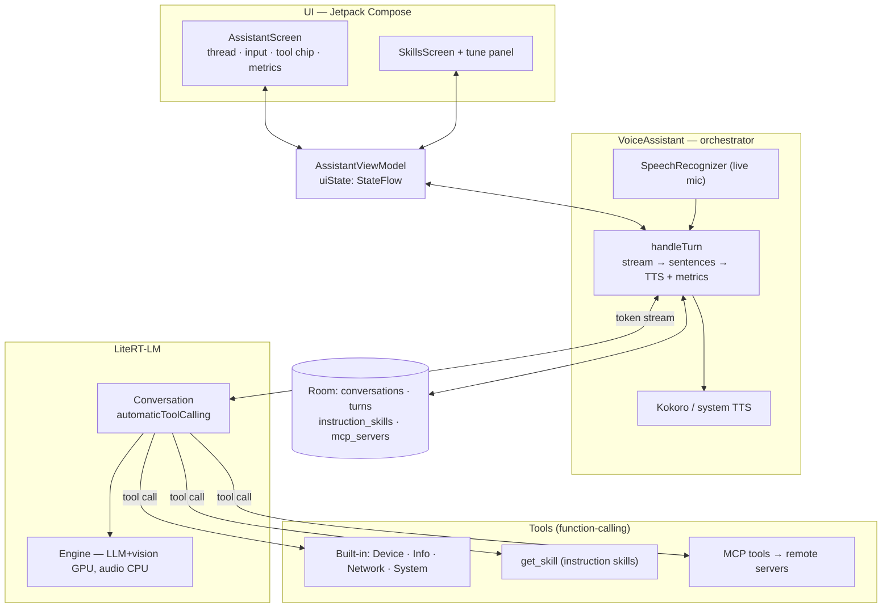

# gemma4-multi-modal-assistant

A fully on-device, multimodal voice assistant for Android. It listens, looks, reasons
with a locally-run **Gemma 4 E2B** model, can take actions on your device, and talks
back with a natural neural voice — once the models are downloaded, **no request ever
leaves the phone**.

---

## Why a native multimodal model (and what "speech token streaming" means)

The core idea of this project is to lean on Gemma 4 E2B being **natively multimodal** —
one model that consumes text, images, **and audio** in the same token space — instead of
stitching together separate speech, language, and vision models.

### How Gemma 4 E2B turns speech into tokens

Gemma 4 E2B (the on-device "E2B" = ~2-billion-*effective*-parameter member of the family)
ships with a built-in **audio encoder** derived from a Universal Speech Model (USM). That
encoder turns raw microphone audio into a stream of **discrete audio tokens** — roughly
**one token per ~160 ms of audio (about 6.25 tokens / second)** — and those tokens are fed
**directly into the same transformer** that handles text and image tokens.

In other words, the model *hears audio as tokens*, exactly the way it *reads text as
tokens*. There is no separate "speech-to-text" model in the middle. Speech recognition,
speech translation, and "answer the spoken question" are all just the one model decoding
from an audio-token prefix.

```
 microphone ──► [USM audio encoder] ──► audio tokens (~6.25/sec) ──┐
                                                                   ├──► Gemma 4 E2B ──► reply
 camera ──────► [vision encoder] ─────► image tokens ─────────────┤
 keyboard ────► text tokens ──────────────────────────────────────┘
```

**Speech token streaming** is the consequence of this: because audio becomes tokens, it can
be **streamed into the model incrementally**. As you speak, audio is chunked, encoded to
tokens, and *prefilled into the model's context (KV cache) while you're still talking* — the
model doesn't have to wait for the full utterance before it starts working.

### Why this is faster than a traditional voice pipeline

A conventional on-device voice assistant runs three separate models, strictly in sequence:

```
mic ─► [ ASR model ] ─► text ─► [ LLM ] ─► text ─► [ TTS ] ─► speaker
        (Whisper /                (waits for the full
         SpeechRecognizer)         transcript first)
```

Every stage blocks the next. The LLM can't even begin its prefill until ASR has produced the
**entire** transcript, so all of the speech-processing latency lands *before* the model does
any thinking.

The native-multimodal approach collapses the front of that pipeline:

- **One model, no separate ASR.** You drop an entire model (and its load time, memory, and
  hand-off latency) from the hot path.
- **Prefill overlaps with speaking.** Audio tokens flow into the KV cache *as you talk*, so by
  the time you stop, most of the prompt is already ingested — which directly lowers
  **time-to-first-token** (the latency you actually feel before the assistant starts replying).
- **No transcription bottleneck or error stage.** You skip ASR's own latency, and you skip the
  class of failures where a wrong transcript quietly misleads the language model.
- **Paralinguistics survive.** The model hears tone, emphasis, hesitation, and language itself
  — information a flat text transcript throws away — so it can respond more appropriately and
  even translate speech directly.

This app exposes that latency directly: every assistant turn shows a **per-turn metrics line**
(time-to-first-token, token counts, tokens/sec) so you can *see* where the time goes — which is
exactly the latency that native audio-token streaming is designed to cut.

### Current status (honest version)

- **Today:** the **live microphone** path uses Android's mature, zero-download
  `SpeechRecognizer` for transcription, while **Gemma 4 E2B's native audio** already powers
  **audio-file attachments** (transcribe / translate / summarize on-device).
- **Roadmap:** replacing the live mic with **native streaming audio tokens** is the next step,
  and it's an *evolution, not a rewrite* — the multimodal engine and the audio sub-model are
  already integrated. That's the change that unlocks the prefill-while-you-speak latency win
  described above.

---

## Architecture at a glance



A more detailed component diagram and a per-turn sequence diagram live in
[`architecture.md`](architecture.md#0-diagrams).

## Features

- **On-device LLM** — `gemma-4-E2B-it` via Google's
  [LiteRT-LM](https://github.com/google-ai-edge/litert) runtime (LLM + vision on GPU, audio on
  CPU, with an all-CPU fallback). Nothing leaves the device.
- **Multimodal input** — text, voice, and media attachments: ask about a **photo** (caption /
  identify / read text) or an **audio clip** (transcribe / translate / summarize), processed
  on-device.
- **Agent tool-calling** — the model invokes on-device **tools** via LiteRT-LM's native
  function-calling: timers, alarms, flashlight, volume, calendar, open app, call/SMS,
  Wi-Fi/Bluetooth/DND, plus read-only info (date/time, battery, connectivity) and optional
  network tools (web search, weather).
- **Custom skills** — write **markdown "instruction" skills** that teach the assistant new
  behaviours. Progressive disclosure keeps prompts small: only a skill's name + description sit
  in the prompt, and the full body loads on demand via a `get_skill` tool.
- **MCP servers** — connect remote **Model Context Protocol** servers (Streamable HTTP); their
  tools are discovered and registered with the model. Manage them on the Skills screen and
  toggle skills/servers per-chat from a quick panel.
- **Per-turn observability** — under each reply: tools invoked, latency, time-to-first-token,
  token usage, and tokens/sec (from the runtime's `BenchmarkInfo`).
- **Neural text-to-speech** — offline [Kokoro](https://github.com/k2-fsa/sherpa-onnx) voices
  via sherpa-onnx, with graceful fallback to the system TTS engine.
- **Streaming, low-latency replies** — sentences are spoken as soon as the model produces them,
  and the transcript is revealed in lockstep with the voice. Barge-in / interrupt supported.
- Built with **Jetpack Compose** (Material 3).

## Requirements

- Android Studio (recent stable release)
- Android device/emulator on **API 28+** (`minSdk 28`, `targetSdk 35`); a physical device is
  recommended for GPU and camera
- A [Hugging Face](https://huggingface.co/) access token to download the Gemma model on first
  launch

## Getting started

1. Clone the repo and open it in Android Studio.
2. Let Gradle sync, then run the `app` configuration on a device or emulator.
3. On first launch, paste your Hugging Face token to download the Gemma model
   (`gemma-4-E2B-it.litertlm`). Optionally download the Kokoro neural voice for higher-quality
   TTS.
4. Grant the microphone permission, tap **Start**, and speak — or type, or attach a photo/audio
   clip.

The Gemma and Kokoro models are downloaded at runtime into app storage and are **not** bundled
in the repo. The lightweight `silero_vad.onnx` VAD model ships in `app/src/main/assets/`.

## Permissions

- `RECORD_AUDIO` — speech recognition
- `INTERNET` / `ACCESS_NETWORK_STATE` — one-time model downloads, and the optional network
  tools / MCP servers
- `com.android.alarm.permission.SET_ALARM` — the timer/alarm tools

## Project layout

| Path | Description |
| --- | --- |
| `app/src/main/java/.../VoiceAssistant.kt` | Core orchestration: input → LLM (tool-calling) → TTS, turns, skills/MCP, metrics |
| `app/src/main/java/.../AssistantViewModel.kt` | UI state + model download management |
| `app/src/main/java/.../tools/AssistantTools.kt` | Built-in on-device tool sets (device / info / network / system) |
| `app/src/main/java/.../tools/InstructionSkill.kt` | Markdown instruction skills + the `get_skill` loader tool |
| `app/src/main/java/.../tools/McpClient.kt` | Minimal MCP client (Streamable HTTP) + tool adapter |
| `app/src/main/java/.../KokoroTts.kt` | Offline neural TTS wrapper (sherpa-onnx) |
| `app/src/main/java/.../AssistantScreen.kt` / `SkillsScreen.kt` | Jetpack Compose UI |
| `app/src/main/java/.../data/ConversationStore.kt` | Room persistence (conversations, turns, skills, MCP servers) |
| `app/libs/sherpa-onnx-*.aar` | Bundled sherpa-onnx native library |

For deeper detail see [`architecture.md`](architecture.md), [`ui-context.md`](ui-context.md),
[`code-standards.md`](code-standards.md), and [`project_tracker.md`](project_tracker.md).

## License

See repository for license details.
