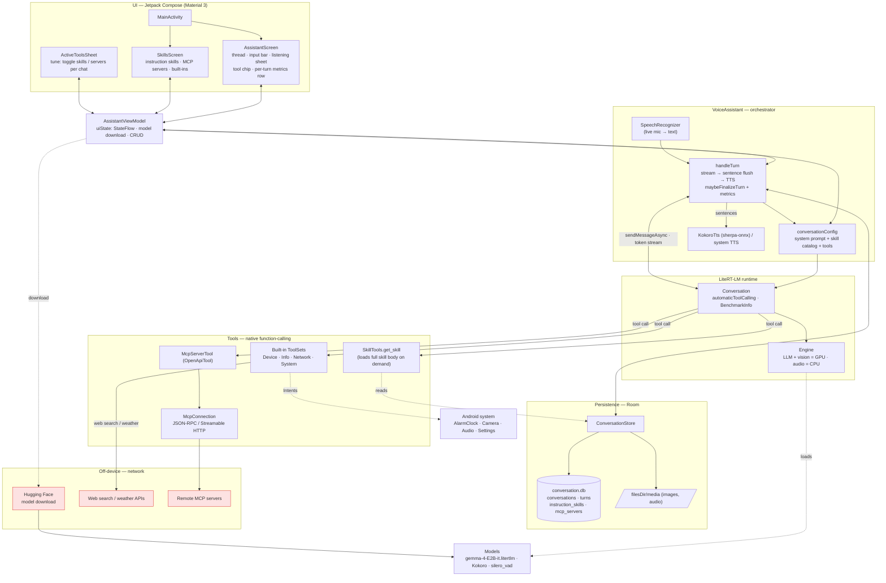
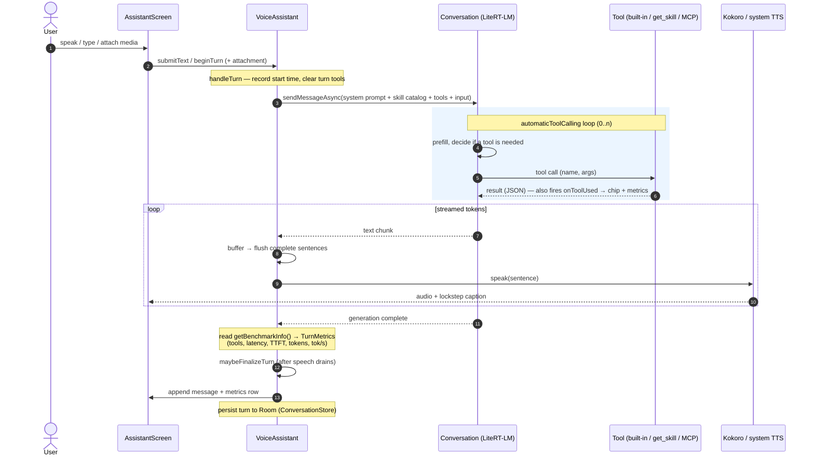

# Architecture

On-device multimodal assistant — Phase 1. Source of truth for components, data flow, contracts, and persistence. Update whenever any of those change (see `CLAUDE.md` → "Keeping docs in sync").

## 0. Diagrams

### Components & data flow



### Per-turn lifecycle (tool-calling + streaming)



## 1. Where Phase 1 sits

The full product is a two-tier cascade: a small on-device model (Gemma 4 E2B) for the easy, private, offline majority, and a larger backend model (Gemma 4 12B) for the hard minority — connected over a private Tailscale / Headscale mesh, never cloud. **Phase 1 builds only the on-device tier.** The backend, the router's "escalate" path, RAG, and the distillation loop are all deferred (see Roadmap). **On-device agent tool-calling has been pulled forward into Phase 1** (see §5b); only external MCP to on-prem systems remains deferred.

On-device, every request is answered by E2B from perception plus its own weights. A "simple task" is whatever E2B can answer without external knowledge or actions — that set is exactly what the future router will keep local, which is why nailing it now pays off twice.

## 2. On-device request flow

```
Voice / Camera / Text
   → assemble prompt (media before text)
   → E2B inference (config: visual token budget + thinking on/off)
   → stream tokens
   → text-to-speech (Kokoro) + live transcript
```

1. **Input** — voice via `SpeechRecognizer`, image via CameraX, or typed text. An `Intent` (Identify / Read / Translate / Summarize / Describe / Chat) is attached, chosen by a camera chip or defaulted.
2. **Assemble** — `buildPrompt` orders image content before the instruction text, with a system prompt selected by intent.
3. **Infer** — `runInference` runs E2B through LiteRT-LM with an `InferenceConfig` derived from the intent (`configFor`): low visual budget + thinking off for simple turns, more for heavier ones. Loads the vision sub-model on demand first.
4. **Stream** — tokens update the transcript and feed completed sentences to TTS as they arrive (reuse the existing handoff).
5. **Persist** — each turn is written to the local `ConversationStore`.

## 3. Components

| Component | File | Responsibility |
| --- | --- | --- |
| Orchestrator | `VoiceAssistant.kt` | Owns the turn lifecycle: STT → prompt → inference → TTS. |
| Multimodal engine | `MultimodalEngine` (new) | Wraps the LiteRT-LM E2B session; image + text in, token stream out; on-demand vision load. |
| ViewModel | `AssistantViewModel.kt` | UI state, model download, image state, persistence wiring. |
| Text-to-speech | `KokoroTts.kt` | Offline neural TTS; streaming sentence playback. |
| Camera | `CameraScreen.kt` + controller (new) | CameraX preview, capture, intent selection. |
| Persistence | `data/ConversationStore.kt` (Room) | Local-first storage of **multiple conversations** (`conversations` + `turns` tables). Turns may carry one media attachment by app-private file path (`mediaPath`/`mediaKind`); `saveMedia` copies a picked Uri into `filesDir/media/`. Summary/window are M5. |
| Media attachments | `AssistantScreen.kt` pickers → `VoiceAssistant.attachMedia` | Android Photo Picker (image) + SAF document picker (audio, `audio/*`) stage one attachment per turn; copied to app-private storage, then sent **media before text**. No video (runtime has no video `Content`). |
| UI | `AssistantScreen.kt` (Conversation), `CameraScreen.kt` | Compose screens — see `ui-context.md`. |

### Media attachments (built)

Implemented ahead of the full `MultimodalEngine`/camera path, for the file-picker source:

```kotlin
enum class AttachmentKind { IMAGE, AUDIO }          // the types LiteRT-LM 0.13.1 accepts (no video)
data class Attachment(val path: String, val kind: AttachmentKind)  // app-private file, never bytes

// VoiceAssistant
fun attachMedia(uri: Uri, kind: AttachmentKind, extension: String) // copies Uri → filesDir/media/, stages it
fun clearPendingAttachment()
// submitText() sends the staged attachment with the next turn; a blank message defaults to
// "What's in this image?" / "What's in this audio?" so media-before-text holds.
```

The turn builds `Contents.of(Content.ImageFile(path) | Content.AudioFile(path), Content.Text(prompt))`
and calls `conversation.sendMessageAsync(contents): Flow<Message>` — the same streaming path as the
text `String` overload. The vision/audio sub-model maps in on first use (no separate load call exists
in 0.13.1); `EngineConfig` sets `visionBackend` + `audioBackend` + `maxNumImages = 1` to enable it.

## 4. Core contracts

Designed to drop into the existing orchestrator (most logic in `VoiceAssistant.kt` or a new `MultimodalEngine.kt`; UI state in `AssistantViewModel.kt`).

```kotlin
// What the user wants from this turn — drives the system prompt + config.
enum class Intent { Chat, Identify, ReadText, Translate, Summarize, Describe }

// The on-device "don't overthink it" dial.
data class InferenceConfig(
    val visualTokenBudget: Int,   // 70 / 140 / 280 / 560 / 1120 — low = fast
    val thinking: Boolean,        // off for simple, on for reasoning
    val maxTokens: Int = 512,
)

// Identify / ReadText / Translate -> budget 140, thinking off (fast)
// Summarize / Describe            -> budget 560, thinking on
// Chat (no image)                 -> thinking off unless the query looks complex
fun configFor(intent: Intent, hasImage: Boolean): InferenceConfig

// One turn's raw inputs.
data class TurnInput(
    val image: Bitmap? = null,
    val spokenText: String? = null,   // SpeechRecognizer output (v1)
    val typedText: String? = null,
    val intent: Intent = Intent.Chat,
)

fun buildPrompt(input: TurnInput): ModelPrompt                                // image BEFORE text
fun runInference(prompt: ModelPrompt, config: InferenceConfig): Flow<String>  // token stream
suspend fun ensureVisionModelLoaded(): Result<Unit>                          // lazy, one-time

// UI state exposed to Compose.
data class AssistantUiState(
    val messages: List<Message>,
    val status: Status,          // Idle, Listening, Loading, Thinking, Speaking, Error
    val pendingImage: Bitmap?,   // captured, awaiting send
    val isOffline: Boolean,
    val activeIntent: Intent,
)

// Local-first persistence.
interface ConversationStore {
    fun observeTurns(): Flow<List<Turn>>
    suspend fun append(turn: Turn): Long
    suspend fun saveImage(bitmap: Bitmap): String        // returns app-private URI/path
    suspend fun recentWindow(limit: Int): List<Turn>     // for prompt assembly
    suspend fun summaryBefore(turnId: Long): String?     // running summary of older turns
}
```

Behavioural notes that aren't obvious from the signatures:
- `runInference` calls `ensureVisionModelLoaded()` whenever the prompt carries an image, flips status to `Loading` for that first map-in, then streams.
- `configFor` is the whole mini-router living on-device.
- `runInference` wraps the LiteRT-LM session's generate call (image + text + config). **Confirm the exact LiteRT-LM image-input / session API against the runtime version in use before implementing** — do not assume signatures.

## 5. Data & persistence

- The **raw conversations** are persisted locally in Room (DB version 7; v6→v7 adds the skill `description` column). Tables: `conversations`, `turns` (`id`, `conversationId`, `role`, `text`, `mediaPath?`, `mediaKind?`, `createdAt`), `instruction_skills` (markdown skills), and `mcp_servers` (remote MCP server configs) — see §5b. `intent` and a `derived_memory` table are deferred to M5/M3. Migrations: v1→v2 backfills the old single thread; v2→v3 adds `mediaPath`/`mediaKind`; v3→v4 added `custom_skills` (Web API skills); v4→v5 replaced it with `instruction_skills`; v5→v6 adds `mcp_servers`.
- **Multiple conversations:** the user manages chats from a navigation drawer (new / switch / delete). `VoiceAssistant` tracks `activeConversationId`; the most-recent chat is opened on launch (an empty one is created if none exist). A chat is auto-titled from its first user message; the drawer is ordered by `updatedAt`.
- **Session isolation:** switching or starting a chat recreates the LiteRT-LM `Conversation` (`resetModelSession`) so context doesn't bleed between chats. **Known gap:** opening an existing chat shows its full transcript but does *not* replay it into the model session, so the model has no memory of earlier turns on continuation — restoring context is part of the deferred windowed + summarized prompt assembly (M5).
- **Turn lifecycle:** `VoiceAssistant` keeps an in-memory `history` (the synchronous source for `AssistantUiState.messages`, so finalizing a turn is flicker-free) and writes through to `ConversationStore` for durability; history is restored from Room when a conversation is activated. A turn is persisted to the conversation it started in, exactly once — when both LLM generation and TTS playback have drained (`maybeFinalizeTurn`).
- **Captured / attached media** are saved to app-private storage (`filesDir/media/`); the DB stores the path, never the bytes.
- **At rest:** app-private storage is already sandboxed per app; optional SQLCipher or an encrypted DataStore for belt-and-suspenders on a privacy demo.
- **Stored history ≠ prompt.** Each turn feeds the model a recent window plus a running summary, not the full log. This keeps E2B's KV cache and latency bounded on long threads — summarize older turns rather than replaying them.

Separation to hold to as the product grows: the raw thread (episodic, verbatim, what the user scrolls) stays local-first forever; only a derived semantic layer (preferences, durable facts, summaries) ever syncs — and only to the private shared store once the backend exists, never to cloud.

## 5b. Tool-calling (assistant agent)

The model is an agent: it can invoke on-device **skills** through LiteRT-LM's **native** tool-calling (verified present in the 0.13.1 AAR — `Tool`/`ToolParam`/`ToolSet`/`ToolProvider`, `ToolKt.tool(...)`, `ToolCall`, `Content.ToolResponse`). No library upgrade and no prompt parsing were needed.

- **Definition:** each skill group is a class implementing `com.google.ai.edge.litertlm.ToolSet` in `tools/AssistantTools.kt`, with `@Tool(description=…)` methods and `@ToolParam(description=…)` parameters. Method names auto snake_case into tool names (`setTimer` → `set_timer`). Methods return a JSON-serializable `Map`; LiteRT serializes via gson (a transitive dep, with `kotlin-reflect`, of litertlm).
- **Registration:** `VoiceAssistant.conversationConfig()` passes `tools = listOf(tool(deviceTools), tool(infoTools), tool(networkTools))` and `automaticToolCalling = true`. The engine runs the model↔tool round-trip internally, so `sendMessageAsync` still streams only the **final spoken text** — the existing streaming → sentence-flush → TTS path in `handleTurn` is unchanged. Because `resetModelSession()` reuses `conversationConfig()`, tools persist across conversation switches.
- **Groups (compiled built-ins):** `DeviceActionsTools` (timers/alarms via `AlarmClock` intents, flashlight via `CameraManager.setTorchMode`, media volume via `AudioManager`, calendar via `ACTION_INSERT`); `SystemTools` (open app via `MAIN`/`LAUNCHER` query + launch intent, phone via `ACTION_DIAL`, SMS via `ACTION_SENDTO` `smsto:`, and Wi-Fi/Bluetooth/Do-Not-Disturb which **open the relevant Settings panel** since modern Android forbids direct toggling) — all on-device; `InfoTools` (date/time, battery, connectivity) — read-only; `NetworkTools` (web search via DuckDuckGo Instant Answer, weather via Open-Meteo) — **require connectivity**, blocking GET with a short timeout, fail soft when offline. Intent-based tools share `launchIntent(...)` and require matching `<queries>` entries in the manifest (Android 11+ package visibility) plus, for alarms, `com.android.alarm.permission.SET_ALARM`.
- **UI feedback:** with `automaticToolCalling = true` the intermediate `ToolCall`s aren't surfaced in the text stream, so each tool reports via an `OnToolUsed` callback → `AssistantUiState.activeTool` → a status chip; the field is cleared in `maybeFinalizeTurn`.
- **Custom (instruction) skills — progressive disclosure:** users add/edit/delete **markdown "instruction" skills** (name + one-line description + markdown body) from the **Skills screen**; each `InstructionSkill` (`tools/InstructionSkill.kt`) is persisted in Room (`instruction_skills`). To keep prompts small, `instructionSkillsBlock()` injects only **name + description** of each enabled skill into the `systemInstruction`; the model loads a skill's **full body on demand** by calling the `get_skill` tool (`SkillTools`), which returns the `instructions` as a tool result. Skills are behaviour guidance (no external calls). `saveInstructionSkill` / `deleteInstructionSkill` persist, reload, and `resetModelSession()`. Built-in tools are compiled and shown read-only (`BuiltInSkills.ALL`).
- **MCP servers:** users configure remote **MCP servers** (`McpServer`, persisted in `mcp_servers`) from the Skills screen — a URL plus optional auth headers. On Android only the **Streamable HTTP** transport is possible (no stdio). `McpConnection` (`tools/McpClient.kt`) is a minimal JSON-RPC client: `initialize` → `notifications/initialized` → `tools/list` / `tools/call`, parsing either a JSON or SSE response and honouring `Mcp-Session-Id`. On launch and on any change, `VoiceAssistant.refreshMcp()` connects to each *enabled* server, discovers its tools, and wraps each as an `McpServerTool` (an `OpenApiTool` whose `parameters` is the MCP `inputSchema` and whose `execute` runs `tools/call`); these providers are appended to `conversationConfig().tools`. Discovery is network + fail-soft (an unreachable server is recorded with an error in `AssistantUiState.mcpServers` and skipped). Whole-server enable/disable only.
- **Quick toggle panel:** the chat top bar's `tune` action opens a bottom sheet (`ActiveToolsSheet`) to enable/disable each instruction skill and MCP server on the fly; toggling persists and re-applies to the session.
- **Per-turn observability:** each assistant reply carries a transient `TurnMetrics` (tools invoked this turn, wall-clock latency, and — from `Conversation.getBenchmarkInfo()`, an `@ExperimentalApi` — time-to-first-token, prefill/decode token counts, and decode tok/s). `handleTurn` records the start time + tool list and reads the benchmark in its `finally`; `maybeFinalizeTurn` attaches it to the `Message`, rendered under the bubble by `TurnMetricsRow`. Not persisted (reloaded history shows no metrics).
- **Persistence:** the final assistant text is persisted as today. Recording per-turn tool calls in Room (a `toolCalls` JSON column) is a deferred nice-to-have.
- **Reliability:** Gemma 4 E2B does zero-shot function-calling but accuracy is modest; keep tool descriptions short and imperative. A dedicated FunctionGemma model is a possible future upgrade. To diagnose, `VoiceAssistant` logs the user turn + final response and `AssistantTools` logs each intent tool invocation and its outcome.

## 6. Model & inference notes — Gemma 4 E2B via LiteRT-LM

- Native multimodal: text, image, audio. Native thinking mode (configurable). Native audio (ASR). **Runtime caveat:** LiteRT-LM 0.13.1 (the AAR in use) exposes `Content` types for Text / Image (`ImageFile`/`ImageBytes`) / Audio (`AudioFile`/`AudioBytes`) only — **there is no video `Content` type**. Video input would require sampling a clip into frames ourselves (deferred). Enable the image/audio encoders via `EngineConfig(visionBackend, audioBackend, maxNumImages)`.
- Order: image content before the text in the prompt.
- Visual token budget: 70 / 140 / 280 / 560 / 1120 — lower is faster with less detail. Default low (140) for identify/read; raise for fine detail (small text, charts).
- Thinking: off for simple turns (latency), on for reasoning. This is the latency dial.
- Memory: text weights ~1.3–1.5 GB; vision/audio load on demand. Target devices ≥ 6 GB RAM. Expect roughly 10–25 tok/s on 2024–25 flagships, so stream output.

## 7. Roadmap — deferred, do not build in Phase 1

- **Phase 2:** backend tier — Gemma 4 12B served by LM Studio (dev) / vLLM (scale); the router's "escalate" path; SSE streaming between client and backend.
- **Transport:** Tailscale mesh (Headscale for full self-hosting). Clients and backend are peer nodes on a private tailnet — never cloud. Multi-client introduces multi-tenancy: per-client identity and memory isolation, request scheduling, and externalized shared state.
- **Phase 3+:** multimodal RAG over local documents, **external MCP** to on-prem systems (on-device tool-calling itself is now built — §5b), a multi-tenant agent-OS kernel (identity / scheduler / guardrails), a shared externalized memory store, and a distillation flywheel (backend traces → fine-tune E2B so the local model handles more over time).

Keep Phase 1 free of any of these dependencies.
